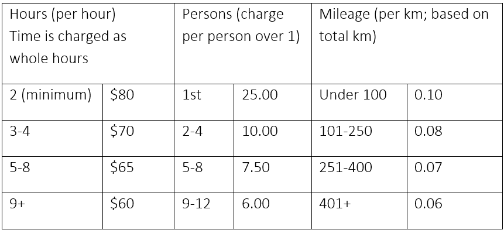
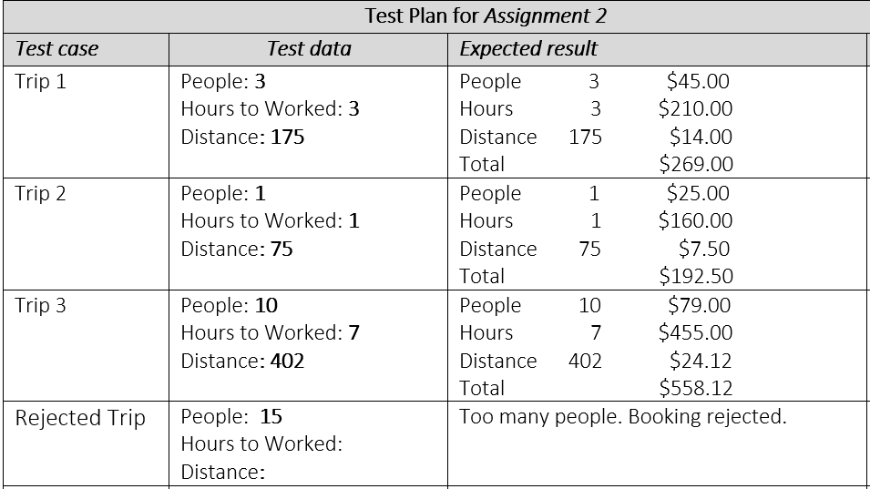

# Spring 2024 Assignment 02 - Control Structures and Error Handling
__Weight:__ 10% of final mark

([Return to Assignments](../README.md)) 

__Submission requirements:__ On or before the deadline, commit a .Net Core 8 Visual Studio 2022 project to the GitHub repository. __You must commit and push to the classroom repository supplied for the assignment__; do not create your own repository. It is your responsibility to ensure that your work is in the correct repository. ___Work not in the repository will not be graded___.

## Limo-IS-Us

Your uncle owns a limo service. The service provides rides on an individual basis as well a for groups up to 12 people. Rides costs are set using the number of people plus per hour plus a mileage charges. 
The cost per person is calculated on numbers as shown in the table below. The hourly cost is set by the number hour as shown in the table below (minimum 2 hours regardless of actual time). The distance is calculated on the entire distance travel as shown in the table below. You are to calculate the charge for booked trip.

### Note: For this assignment, **do not** assume the user will enter valid data.

### Requirements

- Valid dat entered by the user.
- If an amount of people outside of the range 1 to 12 is entered; put out a message indicating the booking is unacceptable.
- Hours must be a positive whole number (minimum value is 2)
- Kilometers must be a positive whole number greater than 0.
- if any validation fails, do NO further processing of the charges.
- Calculate the charge for booked trip if all data is valid.
- Display the inputed data and charges as shown in the sample run.

Input:  		
- Number of people
- Hours booked
- Total Distance in km.

Output: valid	
- Separate totals for people, time and distance.
- Grand total for trip.

Ouput: invalid
  
- Rejected Trip message with appropriate reason

### Sample Run

Several sample trips have been provided for you to test your code. You must also create your own test trip and display your formatted expected results.

### Note: It is suggested that you run your program with different values to ensure your calculations are correct.

## Submission
Commit and push your solution to your GitHub classroom assignment repository before the deadline. Ensure that your solution follows the best coding and style practices, **as your instructor has shown you in class**. Failed adherence to the prescribed style guidelines may result in lost marks. __Your program must compile; a program that fails to compile will not be graded.__

## Code Requirements
- A C# comment block at the beginning of the source file describing the purpose, author, and last modified date of the program
- Write only one statement per line
- Use TitleCase for local variable names
- Use CAPITAL_CASE for any constant variable names

## Rubric
| Mark | Description |
|---|---|
| 5  | Excellent – all requirements meet/coded; program passes all test cases; no errors; coding follows best practices and class standards; includes satisfactory/expected program documentation |
| 4  | Very Good – all requirements meet/coded, program passes most test cases; has minor errors; coding does not follow best practices and class standards; includes satisfactory/expected program documentation |
| 3  | Acceptable – most of the requirements/coded; program produces the expected results for some of the test cases; has major erros; coding does not follow best practices and class standards; does not include satisfactory/expected program documentation |
| 2  | Needs Work – some of the requirements/coded; program fails to produce expected results; has major errors; coding does not follow best practices and class standards; does not include satisfactory/expected program documentation |
| 1  | Unsatisfactory – code does not meet any of the requirements; program fails to produce expected results; has major errors; coding does not follow best practices and class standards; does not include satisfactory/expected program documentation |
| 0  | Not done  |
